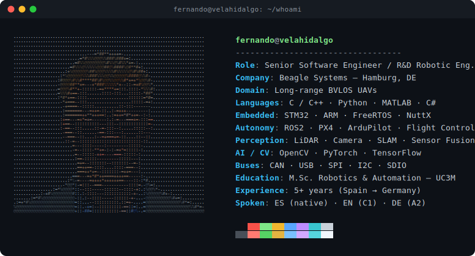
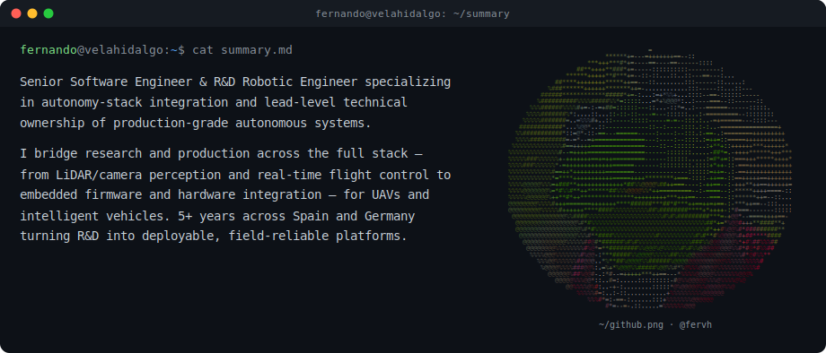

 
 

&nbsp;&nbsp;

&nbsp;&nbsp;

 
 

## <samp>&nbsp;$ cat summary.md&nbsp;</samp>

---

## <samp>&nbsp;➜ ~ tech --stack&nbsp;</samp>

<table width="100%">
  <tbody>
    <tr>
      <td valign="middle"><b>Languages</b></td>
      <td valign="middle"></td>
    </tr>
    <tr>
      <td valign="middle"><b>Robotics & Embedded</b></td>
      <td valign="middle">    </td>
    </tr>
    <tr>
      <td valign="middle"><b>Perception & AI</b></td>
      <td valign="middle"> </td>
    </tr>
    <tr>
      <td valign="middle"><b>Tools</b></td>
      <td valign="middle"></td>
    </tr>
  </tbody>
</table>

---

## <samp>&nbsp;$ git log --oneline experience/&nbsp;</samp>

| Role | Company | Period |
| :--- | :------ | :----- |
| **Senior Software Engineer — UAV Systems** Full UAV software stack, flight control & perception for BVLOS. | Beagle Systems · Hamburg `C++` · `PX4` · `STM32` | _Sep 2025 – Present_ |
| **Research Engineer — Autonomous Vehicles** Perception, mapping & sensor fusion for autonomous vehicles. | AMPL · Madrid `ROS2` · `Python` · `LiDAR` | _Aug 2023 – Jul 2025_ |

---

## <samp>&nbsp;&gt;&gt;&gt; projects&nbsp;</samp>

| Project | Description | Stack |
| :------ | :---------- | :---- |
| **Vehicle Immersion System** | Master's Thesis (10/10) — immersive VR platform for vehicle teleoperation. | `Unity` `VR` `ROS` |
| **Miniature Autonomous Vehicle** | Bachelor's Thesis — end-to-end autonomous driving platform. | `ROS` `OpenCV` `C++` |

---

## <samp>&nbsp;~/edu λ ls degrees/&nbsp;</samp>

- **M.Sc. Robotics and Automation** · Carlos III University of Madrid (UC3M) · _2023 – 2025_  
  Thesis: Vehicle Immersion System — 10/10
- **B.Sc. Industrial Electronics & Automation (Bilingual)** · Carlos III University of Madrid (UC3M) · _2019 – 2023_  
  Thesis: Miniature Autonomous Vehicle

---

## <samp>&nbsp;● achievements.service&nbsp;</samp>

<table width="100%">
  <tr>
    <td width="50%" valign="top">
      <h4>Licenses</h4>
       
       
       
      
    </td>
    <td width="50%" valign="top">
      <h4>Awards</h4>
       
       
      
    </td>
  </tr>
</table>

 

